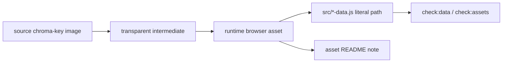

# Asset Naming And Versioning

This project has a large generated-art surface. Consistent names matter because runtime asset paths are wired through static data and checked by local scripts.

## Directory Roles

| Directory | Role |
| --- | --- |
| `assets/*/source/` | Original generated or edited source sheets. |
| `assets/*/transparent/` | Chroma-key-removed intermediate sheets. |
| `assets/*/runtime/` | Browser-loaded runtime assets. |
| `assets/sprites/runtime/defeat-stills/` | Cozy meal stills and horror war-machine defeat stills. |
| `assets/particles/runtime/` | Attack, status, drink, and horror power particles. |
| `output/` | Generated reports, previews, screenshots, contact sheets, and audit images. Usually not runtime input unless explicitly referenced. |
| `tmp/` | Temporary working files. Do not wire runtime assets from here. |



## Naming Basics

Use lowercase kebab-case for asset filenames:

```text
toast-tortoise-war-machine-defeat-v6.png
conversation-wave-20-last-table-v3.png
war-machine-noodle-newt-evolution-v3-chromakey.png
```

Use snake_case for JavaScript ids:

```js
toast_tortoise
level20PreFinal
sunny_side_egg
```

Bridge between them explicitly in data modules. Do not infer asset names from ids at runtime unless there is already a checked helper for that pattern.

## Version Suffixes

Use `-vN` for generated art revisions:

```text
war-machine-toast-tortoise-v3
toast-tortoise-war-machine-defeat-v6.png
conversation-course-5-pattern-doubt-v2.png
```

Version bumps should mean one of:

- improved source generation,
- alpha/chroma-key repair,
- crop or slicing correction,
- readability or silhouette pass,
- active runtime replacement.

Keep older versions when they are useful history or referenced by docs. Remove old versions only after confirming no data/docs/source references still point to them.

## Runtime Sprite Packages

Food-animal runtime packages commonly include:

- four idle frames,
- an evolution preview sheet,
- a sprite manifest,
- optional contact preview under `output/`.

Horror war-machine packages commonly include:

- four mechanical evolution stages,
- one static attack/munition particle,
- one defeat still,
- source and transparent sheets,
- contact/audit preview artifacts.

Document active versions in `assets/sprites/README.md`, especially when the active game uses a later version than the first accepted source sheet.

## Defeat Still Naming

Cozy defeat/meal stills:

```text
<unit-kebab>-defeat-food-vN.png
```

Horror war-machine defeat stills:

```text
<unit-kebab>-war-machine-defeat-vN.png
```

The horror naming is intentionally explicit because these assets are theme replacements, not ordinary meal stills.

## Particles

Use names that identify both owner and behavior:

```text
war-machine-noodle-newt-nanite-discharge-v3.png
drink-buff-throwable_berry_fizz_idle_SW_00.png
food-attack-particle-cozy-static_toast_tortoise_static_idle_SW_00.png
```

Particle assets should avoid baked motion trails unless the renderer expects them. Static projectile/munition icons are easier to reuse in combat and ledger frames.

## Backgrounds And Story Plates

Arena backgrounds:

```text
arena-sunny-breakfast-patio-v1.webp
horror/arena-solar-ration-patio-v1.png
```

Story/cutscene plates:

```text
horror/level10-reveal-war-yard-panorama-v2.png
conversation/runtime/conversation-wave-20-last-table-v3.png
```

Document new background sets in `assets/backgrounds/README.md`, including ratio, runtime use, and active status.

## Cache Tokens

Browser-loaded scripts use content-hash cache tokens from `src/app-scripts.js`.

After changing browser-loaded scripts:

```powershell
npm run update:script-versions
```

CSS files currently use explicit query strings in HTML. If CSS changes need cache busting, update the relevant HTML query string consistently.

Asset paths may also include query suffixes such as `?v=2`. `check:data` and `check:assets` strip query/hash suffixes when validating file existence.

## Validation Rules

Use these checks when touching assets:

```powershell
npm run check:assets
npm run check:data
npm run report:unused-assets
```

`check:assets` scans literal references in app files.

`check:data` loads data modules and verifies exported asset paths exist.

`report:unused-assets` is non-failing and should be interpreted carefully; generated history, source sheets, and review artifacts can be intentionally unused.

## Documentation Rules

Every new runtime asset family should have notes in the closest asset README:

- `assets/sprites/README.md` for units and defeat stills.
- `assets/items/README.md` for topping/drink icons.
- `assets/particles/README.md` for projectiles, throwables, and effects.
- `assets/ui/README.md` for HUD, panels, atlases, buttons, and overlays.
- `assets/backgrounds/README.md` for arenas and cutscenes.
- `assets/start-menu/README.md` for menu and field-guide art.
- `assets/audio/README.md` for music/SFX.

Keep notes short but specific: source path, transparent path, runtime path, active/superseded status, and why a newer version replaced an older one.
