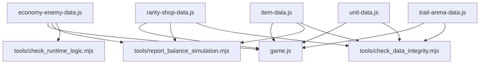

# Combat And Economy Tuning

This document explains where tuning lives and which checks help validate it. It is not a full balance bible; it is the map for changing numbers without losing the thread.

## Tuning Data Map



## Economy Constants

Primary file: `src/economy-enemy-data.js`.

The `ECONOMY` object controls:

- starting gold,
- max gold,
- unit cost,
- item cost,
- win/loss gold,
- interest step, payout, and cap,
- streak gold,
- sell values.

When changing economy values:

1. Run `npm run report:balance`.
2. Inspect `output/balance-simulation-report.json`.
3. Run `npm run check:logic` if helper behavior changes.
4. Play or route-check at least one early prep route and one late route.

## Shop Rarity And Leveling

Primary file: `src/rarity-shop-data.js`.

Important structures:

- `RARITIES`: display style and base shop weights.
- `HORROR_RARITIES`: horror display overrides.
- `SHOP_LEVELS`: upgrade cost, rarity weights, and tier roll chances by shop level.
- `MAX_SHOP_LEVEL`: should match `SHOP_LEVELS.length`.

Current shop level count: `6`.

When changing shop levels:

- Keep every rarity id represented in every `rarityWeights` object.
- Keep `MAX_SHOP_LEVEL` equal to `SHOP_LEVELS.length`.
- Run `npm run check:data`; it verifies level/rarity completeness.
- Run `npm run report:balance`; it writes rarity percentages and entry-tier chances.

## Items And Shop Weight

Primary file: `src/item-data.js`.

Each item has:

- `rarity`
- `price`
- `shopWeight`
- mechanical fields used by battle/shop logic
- cozy and horror asset mappings

`shopWeight` is not the same as rarity. Rarity controls which bucket is selected; `shopWeight` affects selection within item pools.

When changing item prices or weights:

- Check whether early shops become too item-heavy or too expensive.
- Check whether rare/epic items still appear at intended shop levels.
- Run `npm run report:balance` for price summaries.
- Run `npm run check:data` for item validity and asset existence.

## Units, Tiers, And Scaling

Primary files:

- `src/unit-data.js`: base stats, rarity, traits, forms, unit assets.
- `src/economy-enemy-data.js`: tier scaling and enemy scaling.

Units merge through four unit forms. Items/drinks/toppings merge through three item tiers.

When changing unit stats:

- Check base `hp`, `atk`, and `speed`.
- Check the unit's role and trait synergy.
- Check whether the horror variant needs placement or defeat-still scale overrides.
- Run `npm run check:data`.
- Route-check both cozy and horror rendering if sprites changed.

## Enemy Team Generation

Primary files:

- `src/economy-enemy-data.js`: `ENEMY_ARCHETYPES`, boss/final scaling, battle speed options.
- `src/enemy-team-runtime.js`: weighted choices and enemy-plan helper behavior.
- `src/game.js`: route-specific enemy setup, boss gates, and final fight state.

`tools/report_balance_simulation.mjs` samples enemy rarity weights and average support counts for rounds:

```text
1, 3, 5, 8, 10, 15, 20, 25
```

When changing enemy generation:

- Add pure helper assertions to `tools/check_runtime_logic.mjs` if behavior changes.
- Run `npm run report:balance`.
- Check wave 10 and final fight routes:

```text
http://127.0.0.1:8173/local-test-pages/game.html?screen=level-10&start=battle
http://127.0.0.1:8173/local-test-pages/game.html?screen=final-fight&start=battle
```

## Boss Gates

Wave 10:

- Boss round constant: `GIRAFFE_BOSS_ROUND`.
- Boss type: `banana_split_giraffe_boss`.
- Route: `?screen=level-10`.
- Start battle route: `?screen=level-10&start=battle`.
- Reality-break reveal follows the boss path.

Wave 20:

- Final round constant: `FINAL_VICTORY_ROUND`.
- Final boss type: `cyber_brain_final_boss`.
- Minion type: `brainstem_wire_minion`.
- Route: `?screen=final-fight`.
- Start battle route: `?screen=final-fight&start=battle`.
- Victory epilogue route: `?screen=victory-epilogue`.

When changing boss tuning:

- Check the setup route and the `start=battle` route.
- Check copy/theme behavior before and after reality break.
- Check combat ledger capture if battle timing changed.
- Run `npm run check:visual`.

## Battle Speed

Primary file: `src/economy-enemy-data.js`.

Current exported arrays:

- `BATTLE_SPEEDS`
- `BOSS_BATTLE_SPEEDS`

Data checks assert that normal battle speeds include `1x`. If boss speed behavior changes, check route visuals manually because boss pacing is presentation-sensitive.

## Balance Report

Run:

```powershell
npm run report:balance
```

Output:

```text
output/balance-simulation-report.json
```

The report includes:

- economy summary,
- roll costs,
- shop level rarity percentages,
- entry tier chances,
- item price summary by rarity,
- enemy round samples.

This report is non-failing by design. Use it as a review artifact before/after tuning changes.
