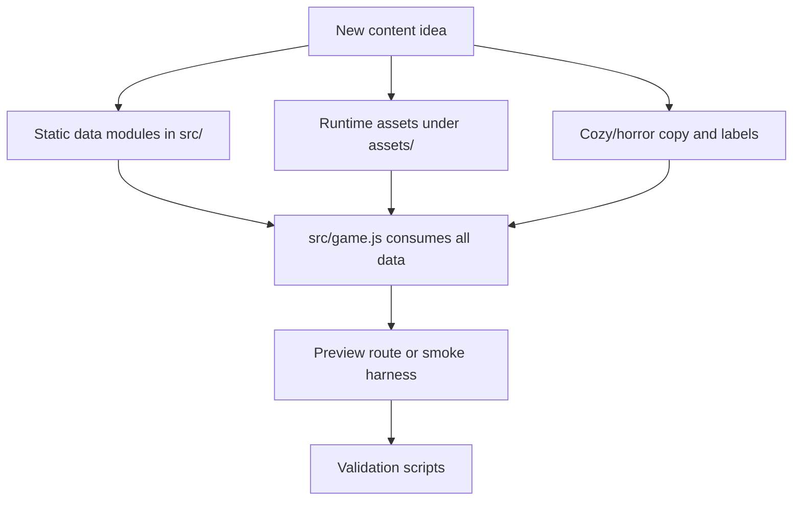

# Content Authoring Guide

This guide is the practical checklist for adding or revising playable content. The game is a static browser app with classic scripts, so content usually means editing data modules, adding literal asset paths, and validating those references with local tools.

Use this with `docs/RUNTIME_ARCHITECTURE.md` for the system map and `docs/ASSET_NAMING_AND_VERSIONING.md` for file naming rules.

## Content Wiring Map



## Add A Food-Animal Line

Primary files:

- `src/unit-data.js`: catalog entry, forms, cozy runtime sprites, horror runtime sprites, cozy defeat still, horror defeat still, optional placement scale overrides.
- `src/trait-arena-data.js`: trait membership expectations, favorite topping entry, favorite combo copy if applicable.
- `src/copy-data.js`: cozy/horror unit names when the displayed names differ by theme.
- `assets/sprites/README.md`: source, transparent, runtime, preview, and active-version notes.
- `assets/particles/README.md`: attack particle notes when the line adds dedicated particles.

Required data contract:

- Every unit needs a stable `id`.
- Every unit must have a valid rarity from `src/rarity-shop-data.js`.
- Every unit must have at least two valid traits.
- Every unit must have four forms.
- Every unit must have cozy runtime sprites, horror runtime sprites, cozy defeat still, and horror defeat still mappings.
- If the line has a favorite topping, the topping id must exist in `src/item-data.js`.

Typical steps:

1. Add or revise runtime art under `assets/sprites/runtime/`.
2. Add defeat stills under `assets/sprites/runtime/defeat-stills/`.
3. Add attack particles under `assets/particles/runtime/` when the unit has a dedicated particle.
4. Add the catalog entry and sprite maps in `src/unit-data.js`.
5. Add trait/favorite-topping data in `src/trait-arena-data.js`.
6. Add theme-specific copy in `src/copy-data.js` when needed.
7. Add notes to `assets/sprites/README.md`.
8. Run `npm run check:data`, `npm run check:assets`, and a relevant route check.

Recommended preview routes:

```text
http://127.0.0.1:8173/local-test-pages/game.html?smoke=basic
http://127.0.0.1:8173/local-test-pages/game.html?theme=horror
```

## Add An Item, Topping, Or Drink

Primary files:

- `src/item-data.js`: item catalog, tier rules, cozy item sprites, horror replacements, drink throwable sprites, attack particle maps.
- `src/copy-data.js`: cozy/horror item names when names diverge by theme.
- `assets/items/README.md`: source/transparent/runtime notes.
- `assets/particles/README.md`: attack or drink throwable particle notes.

Required data contract:

- Every item needs a stable `id`, `name`, `kind: "item"`, and `type: "topping"` or `"drink"`.
- Every item needs a valid rarity, nonnegative price, and nonnegative `shopWeight`.
- Every item needs a cozy sprite mapping.
- Every drink needs cozy and horror throwable sprite mappings.
- Horror replacement art should exist for items that visually transform after reality breaks.

Typical steps:

1. Add item icon assets under `assets/items/runtime/`.
2. Add horror replacement icons under the same runtime directory when applicable.
3. Add attack or throwable particles under `assets/particles/runtime/`.
4. Add catalog and asset mappings in `src/item-data.js`.
5. Add any theme-specific labels in `src/copy-data.js`.
6. Document the source, transparent, and runtime paths in `assets/items/README.md`.
7. Run `npm run check:data`, `npm run check:assets`, and `npm run report:balance` if price/rarity/shop weight changed.

## Add A Story Milestone

Primary files:

- `src/story-data.js`: milestone id, title, round, beats, optional background and background ranges.
- `src/presentation-data.js`: shared story/cutscene art when the asset is part of broader presentation data.
- `assets/backgrounds/README.md`: generated story plate notes.
- `local-test-pages/conversation-*.html`: direct iframe harness when the milestone needs a permanent preview page.

Required route contract:

- Milestones are previewable with `game.html?screen=conversation&story=<id>`.
- The route resolver also accepts `conversation=<id>` and `id=<id>`.
- `level20FinalTabs` uses the final conversation object rather than `STORY_MILESTONES`.
- Milestones with `requiresRealityBroken` render in horror styling.

Typical steps:

1. Add story beats to `src/story-data.js`.
2. Add or wire background art.
3. Add a direct `local-test-pages/conversation-*.html` wrapper if the beat needs review by URL.
4. Add notes in `assets/backgrounds/README.md` if new background plates are introduced.
5. Preview with a conversation route and run `npm run check:visual` for broad route health.

## Add A Route Harness

Primary files:

- `local-test-pages/*.html`: thin iframe or direct app wrapper.
- `src/route-harness.js`: generic query parsing helpers only.
- `src/game.js`: route-specific state setup in the initial route screen section.
- `tools/check_game_routes_highres.mjs`: add the route when it becomes a critical smoke target.

Rules:

- Harness pages should wrap the real app; do not duplicate renderer logic.
- Prefer query params over new standalone app code.
- Keep aliases in `src/game.js` close to existing `FoodAnimalsRouteHarness.matches()` route blocks.
- If a route validates a critical production path, add it to `tools/check_game_routes_highres.mjs`.

## Add A Browser-Loaded Script

Primary files:

- `src/app-scripts.js`: add the script to the appropriate `SCRIPT_GROUPS` entry.
- `tools/check_asset_references.mjs`: already checks that declared script names exist.

Rules:

- Put dependencies before consumers.
- Export a single `window.FoodAnimals...` object when practical.
- Keep data modules before `src/game.js`.
- Run `npm run update:script-versions` after changing browser-loaded scripts.
- Run `npm run check:syntax` and `npm run check:assets`.

## Validation Checklist

Use the smallest check that matches the change while iterating:

- `npm run check:syntax`: JavaScript parse check.
- `npm run check:assets`: literal asset/script/style references.
- `npm run check:data`: catalog and exported asset path contracts.
- `npm run check:logic`: pure runtime helper behavior.
- `npm run report:balance`: non-failing balance snapshot.
- `npm run report:unused-assets`: non-failing tracked asset usage report.
- `npm run check:visual`: high-resolution route screenshots and metrics.
- `npm run check:tutorial`: opening tutorial anchor layout.

Before handing off broad content changes, prefer:

```powershell
npm run check
```

If `check:tutorial` fails only on a small expected-pixel tolerance, capture the exact actual and expected values in the handoff so the next layout pass can decide whether to update the anchor or the assertion.
