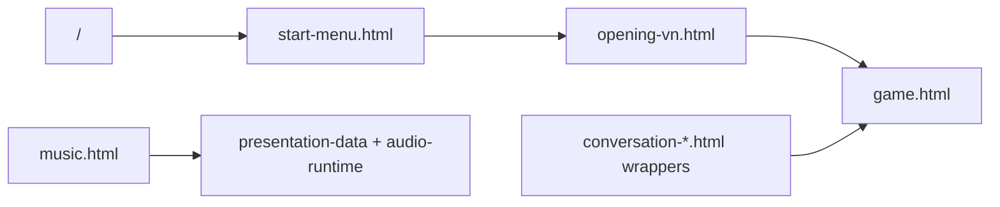

# Routes And Test Harnesses

This project has one root campaign entry and several direct local test pages. The direct pages should stay thin: they exist to load the real screen or iframe the real game route for inspection.

## Entry Points

| URL | Purpose |
| --- | --- |
| `/` | Root campaign shell. Starts on the menu and embeds opening/game routes in `.campaign-frame`. |
| `/local-test-pages/start-menu.html` | Direct start menu route. |
| `/local-test-pages/opening-vn.html` | Direct opening/tutorial visual-novel route. |
| `/local-test-pages/game.html` | Direct game canvas route. |
| `/local-test-pages/music.html` | Direct music loop cycler route. |



## Common Query Params

| Param | Values | Effect |
| --- | --- | --- |
| `smoke` | `basic`, `core-loop` | Seeds deterministic smoke-test state. |
| `theme` | `cozy`, `horror` | Requests cozy or horror presentation. |
| `reality` | `cozy`, `horror` | Forces the reality layer when supported. |
| `screen` or `scene` | See route aliases below | Opens a special route state. |
| `story`, `conversation`, or `id` | Story ids/aliases | Selects a story route when `screen` is a conversation route, or directly when provided. |
| `start`, `phase`, or `mode` | `battle`, `start`, `true`, `1`, `yes`, `auto` | Starts supported boss/final routes in battle. Also participates in run-mode parsing, so use carefully. |
| `runMode`, `run`, or `mode` | `story`, `infinite`, `endless`, `arcade`, `freeplay`, `free-play` | Selects story or infinite mode. |
| `stage` or `at` | `crawl`, `message`, `static`, `fade`, `ideal`, `reboot` | Jumps the victory epilogue to a later beat. |
| `t` or `elapsed` | seconds | Sets victory epilogue elapsed time where supported. |

Music cycler params:

| Param | Values | Effect |
| --- | --- | --- |
| `track` | A music track id such as `market` or `horror-battle` | Opens the cycler on that track. |
| `theme` | `cozy`, `horror` | Filters the track list and selects the first matching track when `track` is absent. |
| `cycle` | `1`, `true`, `yes`, `on` | Enables timed track cycling. |

## Route Aliases

Special game routes are selected in `src/game.js` by `screen` or `scene`.

| Route | Aliases | Notes |
| --- | --- | --- |
| Story conversation | `conversation`, `story`, `story-conversation` | Use with `story=<id>`. |
| Cozy conversation preview | `conversation-cozy`, `cozy-conversation`, `story-cozy` | Synthetic two-beat cozy renderer smoke. |
| Horror conversation preview | `conversation-horror`, `horror-conversation`, `story-horror` | Synthetic two-beat horror renderer smoke. |
| Story canvas smoke | `story-canvas-smoke`, `story-smoke`, `conversation-smoke` | Synthetic story overlay smoke route. |
| Opening tutorial shop | `opening-tutorial-shop`, `tutorial-shop`, `shop-tutorial` | Used by the opening VN tutorial iframe. |
| Level 10 boss | `level-10`, `level10`, `wave-10`, `wave10`, `giraffe-boss` | Banana Split Giraffe setup. |
| Level 10 reveal cutscene | `level-10-cutscene`, `level10-cutscene`, `wave-10-cutscene`, `reveal-cutscene` | Starts the post-boss reveal cutscene. |
| Final fight | `final-fight`, `final-boss`, `overmind` | Neural Overmind setup. |
| Victory epilogue | `victory-epilogue`, `victory-cutscene`, `final-victory` | Final victory cutscene route. |

## Story Route Ids

Current milestone ids:

- `level2`
- `level3`
- `level5`
- `level10`
- `level15`
- `level20PreFinal`
- `level20FinalTabs`

Additional accepted aliases:

- `level20PreFinal`: `level20-pre-final`, `level20-prefinal`, `wave20-final-gate`, `final-gate`.
- `level20FinalTabs`: `level20-final-tabs`, `wave20-last-table`, `last-table`, `final-tabs`.

Examples:

```text
http://127.0.0.1:8173/local-test-pages/game.html?screen=conversation&story=level10
http://127.0.0.1:8173/local-test-pages/game.html?story=final-gate
http://127.0.0.1:8173/local-test-pages/game.html?screen=story-level20-final-tabs
```

## Direct Conversation Pages

These pages iframe the real game renderer:

| Page | Underlying route |
| --- | --- |
| `local-test-pages/conversation-cozy.html` | `game.html?screen=conversation-cozy&reality=cozy` |
| `local-test-pages/conversation-horror.html` | `game.html?screen=conversation-horror&reality=horror` |
| `local-test-pages/conversation-level2.html` | `game.html?screen=conversation&story=level2` |
| `local-test-pages/conversation-level3.html` | `game.html?screen=conversation&story=level3` |
| `local-test-pages/conversation-level5.html` | `game.html?screen=conversation&story=level5` |
| `local-test-pages/conversation-level10.html` | `game.html?screen=conversation&story=level10` |
| `local-test-pages/conversation-level15.html` | `game.html?screen=conversation&story=level15` |
| `local-test-pages/conversation-level20-prefinal.html` | `game.html?screen=conversation&story=level20PreFinal` |
| `local-test-pages/conversation-level20-final-tabs.html` | `game.html?screen=conversation&story=level20FinalTabs` |

## Browser Test Hooks

Each major screen exposes `window.render_game_to_text()` for scriptable inspection. It returns a JSON string; tests should parse it and assert high-level state rather than scrape pixels where possible.

Common hooks:

- `window.render_game_to_text()`: JSON state summary for start menu, opening VN, or game route.
- `window.render_music_test_to_text()`: JSON state summary for the direct music cycler route.
- `window.advanceTime(ms)`: deterministic time advance where implemented.
- `window.__foodAnimals`: selected game internals for debug and test scripts.
- `window.spawnFoodLob()`: menu-only visual harness.
- `window.explodeFirstFoodLob()`: menu-only interaction harness.
- `window.setStartMenuTheme("horror"|"cozy")`: menu theme harness when unlocked.

## Tool Coverage

| Tool | Coverage |
| --- | --- |
| `tools/check_game_routes_highres.mjs` | Root menu, direct menu, opening VN, prep smoke route, level 10 battle, final fight, final story gate. |
| `tools/check_opening_tutorial_anchor.mjs` | Opening VN tutorial iframe and highlight anchor geometry. |
| `tools/check_runtime_logic.mjs` | Pure helper behavior for shop, storage, slots, transitions, battle helpers, rewards, enemy plans, particles, and results. |
| `tools/check_data_integrity.mjs` | Catalog ids, traits, item/unit sprite mappings, story/cutscene timing, exported asset paths. |
| `tools/check_asset_references.mjs` | Literal asset/script/style references in app files and script-loader entries. |

When adding a route that protects a core workflow, add it to `tools/check_game_routes_highres.mjs`. When adding a route only for content review, a thin page under `local-test-pages/` is enough.
