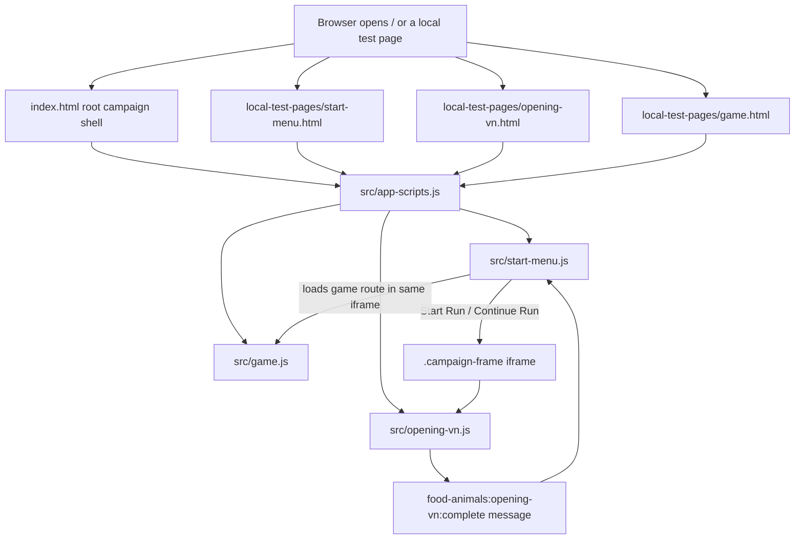
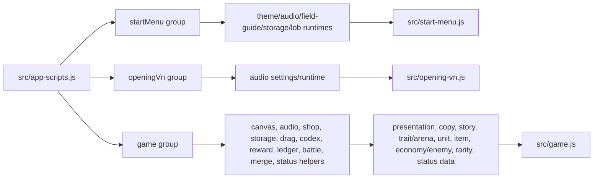
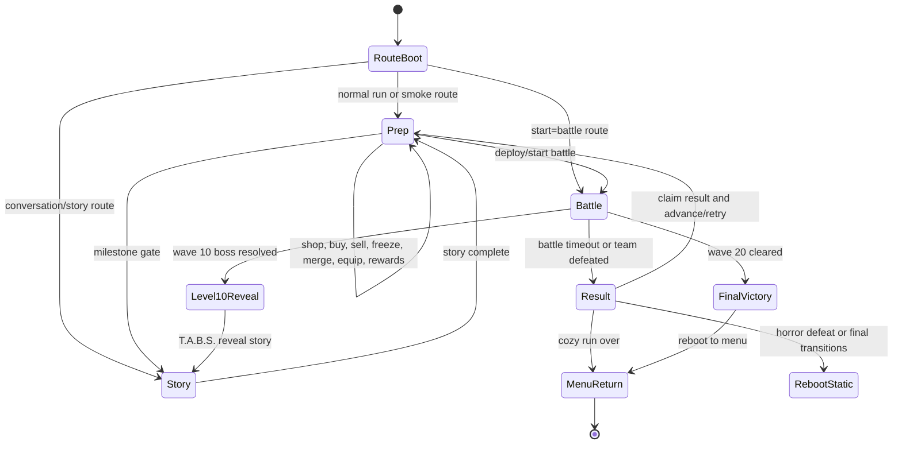
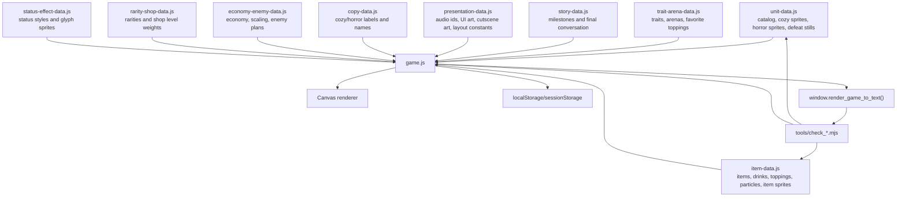
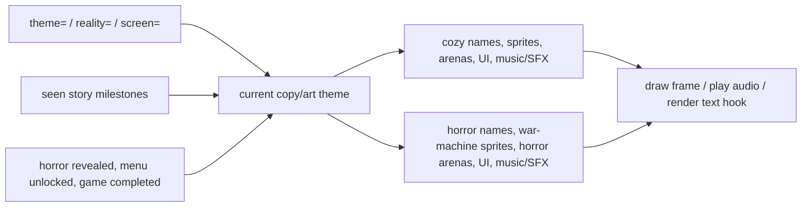
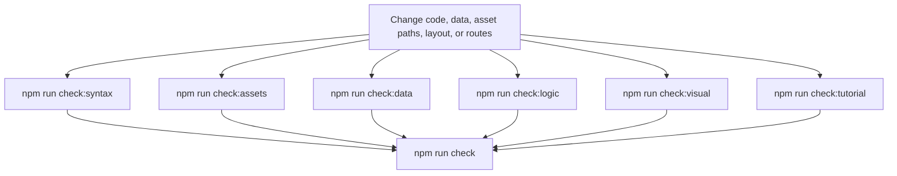

# Runtime Architecture

Project Animal Food Fight is a static browser game. There is no bundler or framework runtime: HTML pages load `src/app-scripts.js`, the script loader appends ordered browser scripts, and each script publishes a small `window.FoodAnimals...` API for later scripts to consume.

The current shape is intentionally split between lightweight entry screens and one large game orchestrator:

- `index.html` is the root campaign shell. It renders the start menu and embeds the opening VN or game route in an iframe so `/` stays stable during the campaign.
- `local-test-pages/start-menu.html`, `local-test-pages/opening-vn.html`, and `local-test-pages/game.html` are direct harnesses for isolated screen checks.
- `src/start-menu.js` handles DOM menu navigation, field-guide browsing, audio settings, run-mode selection, root iframe handoff, and menu-only effects.
- `src/opening-vn.js` handles the opening/tutorial visual-novel flow and notifies the parent shell when the tutorial is complete.
- `src/game.js` owns the full canvas game state, combat loop, shop loop, story gates, route harness, rendering order, and browser test hooks.
- Smaller `src/*-runtime.js`, `src/*-canvas.js`, and `src/*-data.js` files keep reusable logic and static data out of the main file while still loading as classic scripts.

## Entry Flow

## Script Loading Contract

`src/app-scripts.js` is the source of truth for browser script order. Its `SCRIPT_GROUPS` entries must keep dependencies before consumers. The game group loads helpers, rendering utilities, route/test utilities, static data, and finally `src/game.js`.

Maintenance notes:

- Add a new browser-loaded script to the right `SCRIPT_GROUPS` entry before any file that reads its `window.FoodAnimals...` export.
- After changing browser-loaded scripts, run `npm run update:script-versions` so HTML pages and `src/app-scripts.js` get fresh cache tokens.
- `npm run check:assets` validates literal `assets/`, `src/`, and `styles/` references, plus script names declared in `SCRIPT_GROUPS`.

## Module Families

The codebase uses classic script globals rather than imports. Most helper files export exactly one object:

| Family | Typical files | Responsibility |
| --- | --- | --- |
| Entry screens | `start-menu.js`, `opening-vn.js`, `game.js` | Boot visible screens, bind events, own high-level state. |
| Data | `unit-data.js`, `item-data.js`, `story-data.js`, `copy-data.js`, `presentation-data.js`, `trait-arena-data.js`, `economy-enemy-data.js`, `rarity-shop-data.js`, `status-effect-data.js` | Static catalogs, tuning, copy, sprite paths, story beats, and layout constants. |
| Runtime rules | `shop-flow-runtime.js`, `shop-transaction-runtime.js`, `merge-runtime.js`, `battle-flow-runtime.js`, `battle-ability-runtime.js`, `battle-item-runtime.js`, `enemy-team-runtime.js`, `reward-runtime.js`, `status-runtime.js`, `run-storage.js` | Pure or mostly pure decisions used by `game.js` and unit-tested by `npm run check:logic`. |
| Canvas drawing | `canvas-ui.js`, `canvas-text.js`, `card-canvas.js`, `battle-canvas.js`, `slot-canvas.js`, `codex-canvas.js`, `combat-ledger-canvas.js`, `transition-canvas.js`, `story-canvas.js`, `reality-fx-canvas.js`, `selected-panel-canvas.js` | Shared drawing, layout, hit geometry, and animation helpers for the single canvas game surface. |
| Browser services | `audio-settings.js`, `audio-runtime.js`, `runtime-assets.js`, `rng-runtime.js`, `dynamic-asset-manifest.js`, `route-harness.js`, `interaction-runtime.js`, `drag-drop-runtime.js`, `options-menu-runtime.js`, `food-lob-runtime.js`, `field-guide-runtime.js` | Local storage, audio, seeded randomness, dynamic asset manifests, asset caching, route params, input helpers, DOM effects, and test harness support. |

## Game State Flow

`src/game.js` maintains a single mutable `state` object and advances it through prep, battle, result, story, transition, and victory overlays. The state is serialized through `FoodAnimalsRunStorage` for active-run continuation when possible.

Important state layers:

- Board/shop/bench/item state drives the prep loop and drag/drop behavior.
- Battle state is derived from deployed allies plus generated enemies; it records frames/events into the combat ledger.
- Story state is layered on top of prep/battle routes and can force horror copy/art when the milestone requires reality to be broken.
- Transition state blocks certain actions while visual handoffs play.
- Persistent run records include the active route, run mode, round, hearts/hull, gold/scrap, shop level, team, bench, item storage, story progress, and reality flags.

## Data Flow

When adding content, wire all three layers:

1. Static data: add catalog/tuning/copy/story entries in the relevant `src/*-data.js` file.
2. Asset files: add runtime assets under `assets/` and reference them with literal paths where possible.
3. Validation: run `npm run check:data` for exported data contracts and `npm run check:assets` for path coverage.

## Reality Theme System

The game has a cozy presentation layer and a horror/future-war layer. The main runtime determines the current copy/art theme from route params, story progress, run mode, and persistent reveal flags.

Theme-sensitive data generally lives in paired maps:

- Units: `RUNTIME_SPRITES`, `REALITY_RUNTIME_SPRITES`, `DEFEAT_STILL_SPRITES`, `REALITY_DEFEAT_STILL_SPRITES`.
- Items/drinks: cozy item sprites, horror replacement item sprites, attack particles, and drink throwable sprites.
- Copy: `COPY_THEMES.cozy` and `COPY_THEMES.horror`.
- Arenas: cozy arena backgrounds and horror arena replacements.
- Audio/UI: theme-specific music/SFX ids and art assets in `presentation-data.js`.

## Routes And Harnesses

Primary routes:

- `/` root campaign shell.
- `/local-test-pages/start-menu.html` isolated start menu.
- `/local-test-pages/opening-vn.html` isolated opening/tutorial VN.
- `/local-test-pages/game.html` isolated game canvas.

Common query params:

- `?smoke=basic` or `?smoke=core-loop` seeds deterministic game state.
- `?seed=<value>` reproduces the same shop, reward, enemy, combat, and particle random stream for debugging.
- `?theme=cozy` or `?theme=horror` requests a presentation theme.
- `?reality=cozy` or `?reality=horror` forces the reality layer.
- `?screen=conversation&story=level2|level3|level5|level10|level15|level20PreFinal|level20FinalTabs` opens specific in-game conversation milestones.
- `?screen=level-10`, `?screen=final-fight`, and `?screen=victory-epilogue` jump to major late-game routes.
- `?start=battle` begins supported boss/final routes immediately in battle.

Browser test hooks:

- `window.render_game_to_text()` returns a JSON string summarizing the current screen, phase, route, visible story/cutscene state, and important gameplay data.
- `window.advanceTime(ms)` advances deterministic harness time where supported.
- `window.__foodAnimals` exposes selected game internals for targeted debug and tests.
- `window.spawnFoodLob()`, `window.explodeFirstFoodLob()`, and `window.setStartMenuTheme()` are menu harness helpers.

## Verification Map

Use the narrow checks while iterating, then `npm run check` before handing off broad runtime or asset changes. The high-resolution route check writes screenshots and metrics to `output/game-routes-highres-check/`.

## Change Notes

- Script order matters because globals are read synchronously at file load time. A missing or late data module usually fails with an explicit `FoodAnimals... must load before game.js` error.
- Prefer adding pure decisions to small runtime helpers and covering them in `tools/check_runtime_logic.mjs`; keep `game.js` focused on orchestration and canvas integration when possible.
- Prefer literal asset paths in data modules. Dynamic paths are harder for `npm run check:assets` and `npm run report:unused-assets` to reason about.
- Route pages in `local-test-pages/` should stay thin wrappers around the real app. They are harnesses, not alternate implementations.
- `progress.md` is a chronological log. Use this document, the README, and focused asset docs as the stable onboarding/reference layer.
