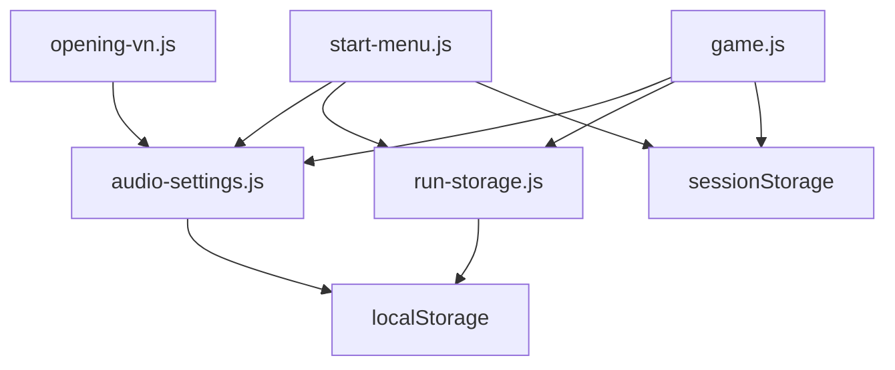

# Save And Progression Contract

The game uses browser storage for audio settings, active-run continuation, menu unlocks, and short-lived transition handoffs. There is no server-side save system.

## Storage Map

| Key | Storage | Owner | Purpose |
| --- | --- | --- | --- |
| `harvest-friends:start-menu-settings:v1` | `localStorage` | `src/audio-settings.js`, `src/start-menu.js`, `src/game.js`, `src/opening-vn.js` | Shared music/SFX settings and selected menu music track. |
| `harvest-friends:active-run:v1` | `localStorage` | `src/run-storage.js`, `src/game.js`, `src/start-menu.js` | Active run record used by Continue Run. |
| `harvest-friends:game-completed:v1` | `localStorage` | `src/game.js`, `src/start-menu.js` | Final completion flag. |
| `harvest-friends:horror-revealed:v1` | `localStorage` | `src/game.js`, `src/start-menu.js` | Reality-break reveal flag. |
| `harvest-friends:horror-menu-unlocked:v1` | `localStorage` | `src/game.js`, `src/start-menu.js` | Enables horror menu theme controls. |
| `harvest-friends:menu-reboot-static:v1` | `sessionStorage` | `src/game.js`, `src/start-menu.js` | One-shot reboot-static transition when returning to menu. |
| `harvest-friends:menu-return-reveal:v1` | `sessionStorage` | `src/game.js`, `src/start-menu.js` | One-shot return reveal transition when returning to menu. |



## Active Run Record

`src/run-storage.js` owns the record wrapper and save version.

Current save version:

```text
SAVE_VERSION = 1
```

Record shape:

```js
{
  active: true,
  route: "current browser route",
  theme: "cozy or horror-ish route theme",
  startedAt: "ISO timestamp",
  updatedAt: "ISO timestamp",
  markerOnly: false,
  snapshot: {
    savedAt: "ISO timestamp",
    version: 1,
    state: { /* game-owned snapshot */ }
  },
  summary: {
    round,
    phase,
    hearts,
    gold,
    shopLevel,
    savedAt
  }
}
```

`activeRecord()` only returns a run if:

- `active === true`
- `route` is a string
- `snapshot` exists and is an object

`targetUrl()` takes the saved route's query/hash, maps it onto the current game target URL, and adds:

```text
from=start-menu
continue=1
```

## Autosave Behavior

`src/game.js` autosaves active runs roughly every `0.75` seconds when storage is available and the current route/state is eligible. It also saves on `pagehide`.

The active run should be cleared when:

- the player purges game data from the menu,
- the run ends and returns to menu,
- the run reaches final completion paths that should not continue from stale state,
- incompatible future save versions are introduced.

## Menu Unlock Flags

The menu reads several flags to decide available actions and themes:

- `game-completed`: marks final completion.
- `horror-revealed`: indicates the story has exposed the horror layer.
- `horror-menu-unlocked`: explicitly unlocks the horror menu option.
- `active-run`: controls Continue Run availability.

The start menu listens for `storage` events for these keys so another tab or iframe can update menu state.

## Session Transition Flags

`menu-reboot-static` and `menu-return-reveal` are session-only, one-shot visual handoffs. The menu consumes and removes them when loading.

Use these for visual continuity only. Do not put durable progression in `sessionStorage`.

## Migration Rules

When changing the active-run snapshot shape:

1. Prefer additive fields that older code can ignore.
2. If removing or renaming fields, bump `SAVE_VERSION` in `src/run-storage.js`.
3. Update snapshot read/write code in `src/game.js`.
4. Decide whether old saves should be ignored, migrated, or purged.
5. Update this document with the new version and compatibility behavior.

When changing storage keys:

1. Keep old keys readable for at least one compatibility pass if the data matters.
2. Update purge-game-data behavior in `src/start-menu.js`.
3. Update `render_game_to_text()` debug metadata if it exposes the key.
4. Update tests or route checks that depend on menu unlocked/completed state.

## Purge Behavior

The menu purge flow should remove durable gameplay and unlock state:

- active run
- game completed flag
- horror menu unlock flag
- horror revealed flag
- transition session flags

It should not remove unrelated browser storage.

## Debugging Checklist

When Continue Run is missing:

- Confirm `localStorage` is available.
- Inspect `harvest-friends:active-run:v1`.
- Confirm the record has `active: true`, a string `route`, and an object `snapshot`.
- Confirm the saved route can be mapped by `FoodAnimalsRunStorage.targetUrl()`.

When horror menu state looks wrong:

- Inspect `harvest-friends:horror-revealed:v1`.
- Inspect `harvest-friends:horror-menu-unlocked:v1`.
- Inspect `harvest-friends:game-completed:v1`.
- Purge game data from the menu and retry from a clean state.
