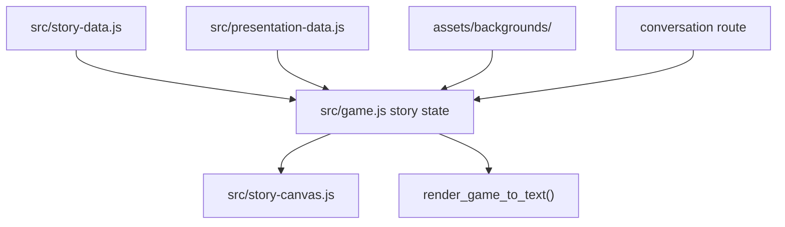

# Story And Cutscene Pipeline

Story content is rendered inside the actual game canvas, not by a separate narrative framework. The main pieces are `src/story-data.js`, `src/story-canvas.js`, `src/game.js`, and presentation/background assets.

## Story Data Flow



## Story Milestones

Primary file: `src/story-data.js`.

Current milestone ids:

- `level2`
- `level3`
- `level5`
- `level10`
- `level15`
- `level20PreFinal`
- `level20FinalTabs`

`level20FinalTabs` is exported as the final T.A.B.S. story object. The others live in `STORY_MILESTONES`.

Common fields:

- `id`
- `title`
- `round`
- `requiresRealityBroken`
- `backgroundSrc`
- `backgroundRanges`
- `beats`

Beat fields may include:

- `speaker`
- `text`
- `tone`
- other renderer-specific metadata consumed by `src/story-canvas.js` and `src/game.js`.

## Adding A Conversation

1. Add the story or final conversation data in `src/story-data.js`.
2. Add background assets under `assets/backgrounds/conversation/runtime/` or the relevant background directory.
3. Reference the background with a literal `assets/...` path.
4. If the story needs a permanent review page, add `local-test-pages/conversation-<name>.html`.
5. Add the background set to `assets/backgrounds/README.md`.
6. Preview with `game.html?screen=conversation&story=<id>`.
7. Run `npm run check:data` and `npm run check:visual`.

Thin conversation page pattern:

```html
<iframe
  title="Conversation: Example"
  src="game.html?screen=conversation&amp;story=level10"
></iframe>
```

Keep wrappers thin. They should not create alternate story renderers.

## Level 10 Reveal Cutscene

Primary files:

- `src/game.js`: route setup, cutscene state, timing, navigation hit tests, update/draw integration.
- `src/presentation-data.js`: reveal cutscene art, total duration, shot data, UI texture paths.
- `assets/backgrounds/README.md`: level 10 reveal background notes.
- `assets/ui/README.md`: overlays, insert plates, FX atlases, and text panels.

Route:

```text
http://127.0.0.1:8173/local-test-pages/game.html?screen=level-10-cutscene
```

When changing reveal timing:

- Keep shot durations consistent with the exported total duration.
- Run `npm run check:data`; it validates the sum of reveal shot durations.
- Route-check the cutscene manually if image framing changes.

## Final Victory Epilogue

Primary files:

- `src/game.js`: victory state, route elapsed handling, reboot transition.
- `src/presentation-data.js`: victory crawl lines and cutscene art.
- `assets/backgrounds/README.md`: victory sunset and idealized market notes.

Routes:

```text
http://127.0.0.1:8173/local-test-pages/game.html?screen=victory-epilogue
http://127.0.0.1:8173/local-test-pages/game.html?screen=victory-epilogue&stage=crawl
http://127.0.0.1:8173/local-test-pages/game.html?screen=victory-epilogue&stage=static
http://127.0.0.1:8173/local-test-pages/game.html?screen=victory-epilogue&stage=ideal
```

Use `t=` or `elapsed=` for exact time-based inspection.

## Horror Versus Cozy Presentation

Story renderer theme depends on story metadata and game state:

- `requiresRealityBroken` forces horror story presentation.
- `level10`, `level15`, and `level20FinalTabs` use horror T.A.B.S. portrait behavior after the reveal.
- Final T.A.B.S. story is treated as a horror route.
- Explicit route params such as `reality=horror` can force inspection.

When adding a story beat after the reveal, verify both:

```text
http://127.0.0.1:8173/local-test-pages/game.html?screen=conversation&story=<id>
http://127.0.0.1:8173/local-test-pages/game.html?screen=conversation&story=<id>&reality=horror
```

## Story QA Checklist

- Text fits within the story panel at desktop and high-res route sizes.
- Speaker names and tone states match the intended theme.
- Backgrounds are not too busy behind text-safe regions.
- Horror story beats use horror portrait/panel assets where intended.
- `render_game_to_text()` exposes the expected story id/title/index.
- Route wrapper pages use the real game renderer.
- `npm run check:data` passes after adding background paths.
- `npm run check:visual` passes after changing shared story renderer layout.
